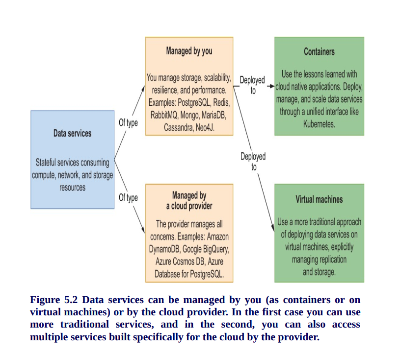

# Catalog Service

This application is part of the Polar Bookshop system and provides the functionality for managing
the books in the bookshop catalog. It's part of the project built in the
[Cloud Native Spring in Action](https://www.manning.com/books/cloud-native-spring-in-action) book
by [Thomas Vitale](https://www.thomasvitale.com).

## REST API

| Endpoint	      | Method   | Req. body  | Status | Resp. body     | Description    		   	     |
|:---------------:|:--------:|:----------:|:------:|:--------------:|:-------------------------------|
| `/books`        | `GET`    |            | 200    | Book[]         | Get all the books in the catalog. |
| `/books`        | `POST`   | Book       | 201    | Book           | Add a new book to the catalog. |
|                 |          |            | 422    |                | A book with the same ISBN already exists. |
| `/books/{isbn}` | `GET`    |            | 200    | Book           | Get the book with the given ISBN. |
|                 |          |            | 404    |                | No book with the given ISBN exists. |
| `/books/{isbn}` | `PUT`    | Book       | 200    | Book           | Update the book with the given ISBN. |
|                 |          |            | 201    | Book           | Create a book with the given ISBN. |
| `/books/{isbn}` | `DELETE` |            | 204    |                | Delete the book with the given ISBN. |

## Useful Commands

| Gradle Command	         | Description                                   |
|:---------------------------|:----------------------------------------------|
| `./gradlew bootRun`        | Run the application.                          |
| `./gradlew build`          | Build the application.                        |
| `./gradlew test`           | Run tests.                                    |
| `./gradlew bootJar`        | Package the application as a JAR.             |
| `./gradlew bootBuildImage` | Package the application as a container image. |

After building the application, you can also run it from the Java CLI:

```bash
java -jar build/libs/catalog-service-0.0.1-SNAPSHOT.jar
```
## Database Setup
### Container Commands
**PowerShell**
```shell
docker run -d --name polar-postgres `
    -e POSTGRES_USER=user `
    -e POSTGRES_PASSWORD=password `
    -e POSTGRES_DB=polardb_catalog `
    -p 5432:5432 `
    postgres:14.4
```
**Bash**
```bash
docker run -d \
    --name polar-postgres \
    -e POSTGRES_USER=user \
    -e POSTGRES_PASSWORD=password \
    -e POSTGRES_DB=polardb_catalog \
    -p 5432:5432 \
    postgres:14.4
```

| Docker Command	                     | Description       |
|:------------------------------------|:-----------------:|
| `docker stop polar-postgres`        | Stop container.   |
| `docker start polar-postgres`       | Start container.  |
| `docker remove polar-postgres`      | Remove container. |

### Database Commands

Start an interactive PSQL console:

```bash
docker exec -it polar-postgres psql -U user -d polardb_catalog
```

| PSQL Command	              | Description                                    |
|:---------------------------|:-----------------------------------------------|
| `\list`                    | List all databases.                            |
| `\connect polardb_catalog` | Connect to specific database.                  |
| `\dt`                      | List all tables.                               |
| `\d book`                  | Show the `book` table schema.                  |
| `\quit`                    | Quit interactive psql console.                 |

From within the PSQL console, you can also fetch all the data stored in the `book` table.

```bash
select * from book;
```
### Database Infrastructure




# Docker infrastructure


## Build and push image to github repository
```shell
./gradlew bootBuildImage `
    --imageName ghcr.io/<your_github_username>/catalog-service `
    --publishImage `
    -PregistryUrl=ghcr.io `
    -PregistryUsername=<your_github_username> `
    -PregistryToken=<your_github_token
```

# Deployment pipeline
## Packages and publishing

## Validating Kubernetes manifests in the commit stage

```shell
kubeval --strict -d k8s
```

# Kubernetes fundamentals


## Start minikube
```shell
minikube start --cpus 2 --memory 4g --driver docker --profile polar
minikube addons enable ingress --profile polar
minikube tunnel --profile polar
minikube stop --profile polar
minikube delete --profile polar
kubectl get all -n ingress-nginx
kubectl get ingress
kubectl get nodes
kubectl config get-contexts
minikube stop --profile polar
```
```bash
## How to deploy to Kubernetes locally
```bash
./gradlew bootBuildImage \
minikube image load catalog-service --profile polar \
kubectl apply -f k8s/deployment.yml \
kubectl get all -l app=catalog-service \
kubectl logs deployment/catalog-service \
```
## Service discovery and load balancing


### CREATING A SERVICE OBJECT FROM A MANIFEST
```bash
kubectl apply -f k8s/service.yml \
kubectl get svc -l app=catalog-service \
kubectl port-forward service/catalog-service 9001:80
```